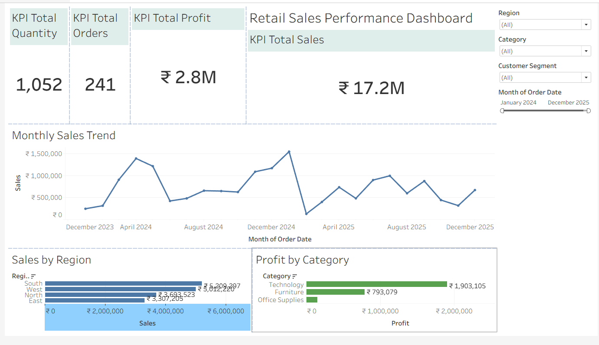

# Retail Sales Performance Dashboard

An interactive Tableau project analysing retail sales, profitability, order performance, customer segments, product rankings and future sales forecasts.

## Dashboard Preview

## Live Dashboard

[View the interactive dashboard on Tableau Public](https://public.tableau.com/views/RetailSalesPerformance_17890967639390/RetailSalesExecutiveStory?:language=en-US&:display_count=n&:origin=viz_share_link)

## Project Overview

This project transforms retail transaction data into an interactive business-intelligence dashboard and executive story. It enables users to monitor performance, investigate sales drivers and identify areas requiring management attention.

## Key Performance Indicators

- Total Sales: ₹17.2M
- Total Profit: ₹2.8M
- Total Quantity: 1,052
- Distinct Orders: 241
- Analysis Period: January 2024 to December 2025

## Dashboard Features

- Sales and profit KPI cards
- Monthly sales trend analysis
- Regional and category performance
- Customer-segment analysis
- Dynamic Top-N product parameter
- Top 10 highest-value orders
- Year-over-year sales growth
- Six-month sales forecast
- Interactive date and category filters
- Dashboard filter actions
- Five-point executive storyboard

## Key Insights

- Sales decreased by 11.7% in 2025 compared with 2024.
- Business Laptop Pro was the highest-selling product at approximately ₹5.8M.
- ORD-10245 was the highest-value order at approximately ₹554K.
- The South region generated the highest sales at approximately ₹5.2M.
- Technology was the leading sales category.

## Tableau Techniques Used

- Calculated fields
- FIXED Level of Detail expressions
- Table calculations
- Parameter-driven Top-N filtering
- Dashboard actions
- Continuous date analysis
- Forecasting with 95% prediction intervals
- Interactive filters
- Executive storytelling

## Tools Used

- Tableau Public
- Microsoft Excel
- GitHub

## Author

Pruthvikrishna Ambati
